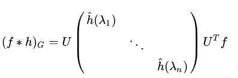

# Graph Convolutional Networks (GCN)

- [Semi-Supervised Classification with Graph Convolutional Networks](https://arxiv.org/abs/1609.02907)

## 1. Introduction to Graph

### Graph Basics

A Graph is defined as $G = (V,E)$

- V: a finite, nonempty set of vertices
- E: a set of edges / pairs of vertices


```
V = {1,2,3,4,5}
E = {(1,2),(1,3),(1,4),(2,4),(2,5),(4,5)}
```

#### Graph type

- Undirected: edge (u,v) = edge (v,u)
- Directed: edge (u,v) goes from vertex u to vertex v; $(u,v) \neq (v,u)$
- Weighted: edges associate with weights

<p align="center">
  
</p>

```
V = {1,2,3,4,5}
E = {(2,1),(1,3),(4,1),(2,4),(2,5),(5,4)}
```

#### Terminate

- Adjacent
  
  If there is an edge (u,v), then u and v are adjacent.

- Incident
  
  If there id an edge (u,v), the edge (u,v) is incident from u and is incident to v.

<span id="degree"></span>

- Degree: 

  The degree of a vertex u is the number of edges incident on u.

    - in-degree of u: edges (x,u) in a directed graph.
    - out-degree of u: edges (u,x) in a directed graph.
    - Degree = in-degree + out-degree
    - Isolated vertex: degree = 0
  
- Connected:

  - Two vertices are connected if there is a path between them.
  - A connected graph has a path from every vertex to every other.

### Graph Representations

How to represent a graph in computer programs?

<span id="adjacencymatrix"></span>

#### Adjacency Matrix

Adjacency matrix = $N \times N$ matrix A with $A[i][j] = 1$ if (i,j) is an edge.

$$ 
A_{ij} := 
  \begin{cases}
  1 & \text{if (i,j)} \in E \\
  0  & \text{otherwise} \\
  \end{cases}
$$

<p>
  <center>
      
      
  </center>
</p>

- For undirected graphs, A is symmertric, $A = A^T$
- If weighted, store weights instead of bits in $A$

<span id="degreematrix"></span>

#### Degree Matrix

Degree matrix is a `diagonal matrix` wich contains information about the [degree](#degree) of each vertex.

Given a graph $G = (V,E)$ with $\left|V\right| = n$, the `degree matrix` D for G is a $N \times N$ diagonal matrix defined as:

$$ 
D_{ij} := 
  \begin{cases}
  deg(v_i) & \text{if i = j} \\
  0  & \text{otherwise} \\
  \end{cases}
$$

<p>
  <center class="half">
    
    
  </center>
</p>

## 2. Spectral Graph Theory

In mathmatics, `spectral graph theory` is the study of the properties of a graph in relationship to the `characteristic polynomial`, `eigenvalues`, and `eigenvectors` of matrices associated with the graph, such as its [adjacency matrix](#adjacencymatrix) or `Laplacian matrix`.

### Laplacian matrix

Given a simple graph G with n vertices, its Laplacian matrix L is defined as :

$$ L = D - A $$

where D is the [degree matrix](#degreematrix) and A is the [adjacency matrix](#adjacencymatrix) of the graph.

$$
L_{ij} := 
  \begin{cases}
  deg(v_i) & \text{if } i = j \\
  -1 & \text{if } i \neq j \text{ and } v_i \text{is adjaceney to } v_j \\
  0  & \text{otherwise} \\
  \end{cases}
$$

where $deg(v_i)$ is the degree of the vertex $i$.

#### Properties

- L is symmetric matrix.
- L is [positive-semidefinite](https://en.wikipedia.org/wiki/Definiteness_of_a_matrix) matrix.

#### Example


#### Other Laplacian matrix

- Random walk normallized Laplacian matrix

$$ L^{rw} = D^{-1}L = I - D^{-1}A $$

- Symmetric normalized Laplacian matrix

$$ L^\text{sym} = D^{-1/2}LD^{-1/2} = I - D^{-1/2}AD^{-1/2} $$

#### Orthogonal diagonalization

Because L is a real-symmetric matrix, it can be diagonalized by an orthogonal matrix.

$$ L = U \Lambda U^T $$

where

- U is a eigenvector of L, and is orthgonoally matrix: $UU^T = I, U^{-1} = U^T$.
- $\Lambda$ is a diagonal matrix that consists of the eigenvalue of L.


## 3. Laplace operator

The `Laplace operator` or `Laplacian` is a `differential operator` given by the `divergence` of the `gradient` of a function on `Euclidean space`. 

It defined as `the divergence (∇·) of the gradient (∇f)`.

The Laplacian of f is defined by:

$$ \Delta f = \nabla^2f = \nabla\cdot\nabla f $$

where

$$ \nabla = \left(\frac{\partial}{\partial_{x_1}},\cdots,\frac{\partial}{\partial_{x_n}}\right)$$

So

$$ \Delta f = \sum_{i=1}^{n} \frac{\partial^2 f}{\partial x_i^2} $$


### Heat Conduction Model on Graph 

[Heat conduction](https://simple.wikipedia.org/wiki/Heat_conduction) (or `thermal conduction`) is the movement of heat from one object to another one that has different temperatures when they are touching each other. 

```
Heat flows from the hotter object to the colder one.
```

#### Heat Conduction Model on One-dimension


For node $i$, it's only connected with node $i-1$ and node $i+1$, and the temperatures will be changed by these two nodes (receive from node $i+1$, transfer to node $i-1$). 

If the current temperature of node $i$ is $\phi_i$,

$$ \frac{d\phi_i}{dt} = k(\phi_{i+1} - \phi_i) + k(\phi_i - \phi_{i-1})$$

$$ \frac{d\phi_i}{dt} - k[(\phi_{i+1} - \phi_i) -(\phi_i - \phi_{i-1})] = 0 $$

$$ \frac{\partial \phi}{\partial t} - k\frac{\partial^2 \phi}{\partial x^2} = 0 $$

$$ \frac{\partial \phi}{\partial t} - k\frac{\partial^2 \phi}{\partial x^2} = 0 $$

$$ \frac{\partial \phi}{\partial t} - k \Delta \phi  = 0 $$

=> 

1. 在歐式空間中，某溫度升高的速度正比於該點周圍的溫度分佈，用Laplace operator衡量

2. Laplace operator是二階導數對高維空間的推廣

#### Heat Conduction Model on Graph

現在讓我們將熱傳播模型推廣到Graph上

如下圖中所示，點1只和點2跟點3發生熱交換，點5的熱量要通過點2間接傳過來，而沒有直接熱交換。


根據一維熱傳播模型，這Graph上溫度隨時間的變化可以寫成以下：

$$ \frac{d\phi_i}{dt} = -k\sum_j A_{ij}(\phi_i - \phi_j) $$

where A is [adjacency matrix](#adjacencymatrix)

=>

$$
\begin{aligned}
\frac{d\phi_i}{dt} & = -k\sum_j A_{ij}(\phi_i - \phi_j) \\
& = -k[\phi_i \sum_j A_{ij} - \sum_j A_{ij} \phi_j] \\
& = -k[deg(i) \phi_i - \sum_j A_{ij} \phi_j]
\end{aligned}
$$

=>

$$
\begin{bmatrix} 
  \frac{d\phi_1}{dt} \\
  \frac{d\phi_2}{dt} \\
  \cdots \\
  \frac{d\phi_n}{dt} \\
\end{bmatrix}
= -k 
\begin{bmatrix} 
  deg(1) \times \phi_1 \\
  deg(2) \times \phi_2 \\
  \cdots \\
  deg(n) \times \phi_n \\
\end{bmatrix}
+ kA
\begin{bmatrix} 
  \phi_1 \\
  \phi_2 \\
  \cdots \\
  \phi_n \\
\end{bmatrix}
$$

define $\phi = [\phi_1, \phi_2, \cdots, \phi_n]^T$, then

$$
\begin{aligned}
  \frac{d\phi}{dt} & = -kD\phi + kA\phi \\
  & = -k(D - A)\phi
\end{aligned}
$$

=> 

$$ \frac{d\phi}{dt} + kL\phi = 0 $$

=> 

$$ L = D - A $$

#### 推廣到GCN

假設在圖中各個節點流動的東西不是熱量，而是特徵(Feature)，而是訊息(Message)，那問題就自然被推廣到了GCN。

所以GCN就是在一張Graph Network中特徵(Feature)和訊息(Message)中的流動傳播。

## 4. Convolution and Forurier Transfornm

- Convolution

  The convolution of $f$ and $g$ is written $f*g$,

$$ (f * g)(t) = \int_{- \infty}^{ \infty} f(\tau)g(t-\tau)d\tau $$

- Fourier Transform

$$ F\{f\}(w) = \int_{- \infty}^{ \infty} f(x)e^{-iwx}dx $$

* Inverse Fourier transform

$$ F^{-1}\{f\}(x) = \int_{- \infty}^{ \infty} f(w)e^{iwx}dx $$

### 推導

$$
\begin{aligned}
h(z) = \int_{- \infty}^{ \infty} f(x)g(z-x)dx
\end{aligned}
$$

$$
  \begin{aligned}
    F\{f * g\}(z) & = F\{h\}(z) \\
    & = \int_{- \infty}^{ \infty} h(z)e^{-iwz}dz \\
    & = \int_{- \infty}^{ \infty}\int_{- \infty}^{ \infty} f(x)g(z-x)e^{-iwz} dxdz \\
    & = \int_{- \infty}^{ \infty} f(x) (\int_{- \infty}^{ \infty} g(z-x)e^{-iwz} dz) dx
  \end{aligned}
$$

Let $y = z - x$, $dy = dz$

$$
  \begin{aligned}
    F\{f * g\}
    & = \int_{- \infty}^{ \infty} f(x) (\int_{- \infty}^{ \infty} g(y)e^{-iw(y+x)} dy) dx \\
    & = \int_{- \infty}^{ \infty} f(x)e^{-iwx}dx \int_{- \infty}^{ \infty} g(y)e^{-iwy}dy \\
    & = F\{f\} \cdot F\{g\}
  \end{aligned}
$$

$$ f * g = F^{-1}\{F\{f\} \cdot F\{g\}\} $$ 

## 5. Graph Fourier

- Traditional Fourier

$$ F(W) = \hat{f}(w) = \int_{- \infty}^{ \infty} f(x)e^{-iwx}dx $$

- Graph Fourier

$$ F(\lambda_i) = \hat{f}(\lambda_i) =  \sum_{k=1}^N f(k)u^*_i(k) $$

  

  => $\hat{f} = U^Tf$

- Traditional Inverse Fourier

$$ F^{-1}[{F}(w)] = f(x)= \int_{- \infty}^{ \infty} F(w)e^{iwx}dx $$

- Graph Inverse Fourier

$$ f(i) =  \sum_{k=1}^N \hat{f}(\lambda_i)u_k(i) $$

=> $f = U\hat{f}$

## 6. Graph Convolution

- Traditional Convolution

$$ f * h = F^{-1}\{F\{f\} \cdot F\{h\}\} $$ 

- Graph convolution

$$ (f * h)_G = U((U^T f) \odot (U^T h)) $$

where $\odot$ is the element-wised product (as known as `Hadamard product`).

Let $\hat{h}(\lambda_i) =  \sum_{k=1}^N h(k)u^*_i(k)$, then:

  

<script type="text/javascript" src="http://cdn.mathjax.org/mathjax/latest/MathJax.js?config=TeX-AMS-MML_HTMLorMML"></script>
<script type="text/x-mathjax-config"> MathJax.Hub.Config({ tex2jax: {inlineMath: [['$', '$']]}, messageStyle: "none" });</script>
